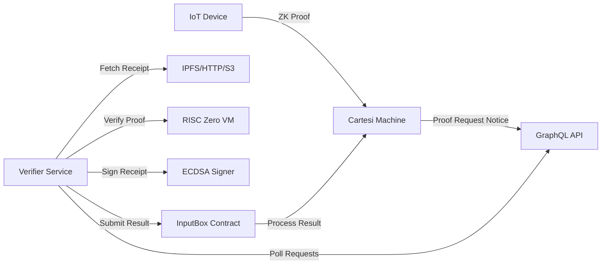

# L{CORE} RISC Zero Proof Verifier

A high-performance side-car service that verifies RISC Zero proofs for the L{CORE} IoT platform. This service runs alongside Cartesi nodes to handle computationally intensive proof verification operations, enabling scalable and secure IoT data processing with zero-knowledge proofs.

## Overview

The L{CORE} Verifier is a critical component of the L{CORE} IoT ecosystem that:

- **Verifies RISC Zero Proofs**: Validates cryptographic proofs from IoT devices
- **Ensures Data Integrity**: Confirms that sensor data processing is correct and tamper-proof  
- **Scales Verification**: Offloads proof verification from the main Cartesi rollup
- **Maintains Security**: Uses ECDSA signatures and image ID allowlists for authorization

## Architecture

The verifier implements a dual-service architecture pattern for optimal performance:



### Key Components

1. **GraphQL Poller**: Continuously monitors for new proof requests
2. **Receipt Fetcher**: Downloads proof receipts from various sources (IPFS, HTTP, S3)
3. **RISC Zero Verifier**: Validates cryptographic proofs using the RISC Zero VM
4. **ECDSA Signer**: Signs verified receipts for authenticity
5. **InputBox Client**: Submits verified results back to the Cartesi rollup

## Features

- **Asynchronous Proof Verification**: Polls GraphQL for proof requests
- **Multiple Receipt Sources**: Supports IPFS, HTTP, and S3 URLs
- **ECDSA Signing**: Signs verified receipts with Ethereum-compatible signatures
- **Image ID Validation**: Ensures only authorized programs are accepted
- **Configurable**: Environment variables and TOML configuration

## Configuration

### Environment Variables

```bash
# Required Configuration
VERIFIER_PRIVATE_KEY=your_private_key_here  # Private key for signing receipts (without 0x prefix)
ALLOWED_IMAGE_IDS=0ximage1,0ximage2  # Comma-separated allowed RISC Zero image IDs

# Service Endpoints
GRAPHQL_ENDPOINT=http://localhost:8000/graphql  # Cartesi GraphQL endpoint
INPUTBOX_ENDPOINT=http://localhost:8080/input   # InputBox contract endpoint
DAPP_ADDRESS=0x0000000000000000000000000000000000000000  # Target DApp address

# Optional Configuration
POLL_INTERVAL_SECS=10           # How often to check for new proof requests
IPFS_GATEWAY=https://ipfs.io    # IPFS gateway for fetching receipts
MAX_RECEIPT_SIZE=10485760       # Maximum receipt size (10MB)
REQUEST_TIMEOUT_SECS=30         # HTTP request timeout
```

### Configuration File (verifier.toml)

```toml
graphql_endpoint = "http://localhost:8000/graphql"
inputbox_endpoint = "http://localhost:8080/input"
dapp_address = "0x0000000000000000000000000000000000000000"
verifier_private_key = "your_private_key_here"
allowed_image_ids = ["0xYOUR_IOT_VALIDATION_IMAGE_ID", "0xYOUR_IOT_PRIVACY_IMAGE_ID"]
poll_interval_secs = 10
ipfs_gateway = "https://ipfs.io"
max_receipt_size = 10485760  # 10 MB
request_timeout_secs = 30
```

## Installation

### Prerequisites

- **Rust 1.82+** with nightly toolchain
- **RISC Zero toolchain** for proof verification
- **Access to a Cartesi node** with GraphQL endpoint
- **Private key** for signing verified receipts

### From Source

```bash
# Clone the repository
git clone https://github.com/Modern-Society-Labs/lcore-verifier.git
cd lcore-verifier

# Install Rust nightly (required for edition2024)
rustup toolchain install nightly
rustup default nightly

# Build the project
cargo build --release

# Copy and configure
cp verifier.toml.example verifier.toml
# Edit verifier.toml with your configuration
```

### Using Docker

```bash
# Pull the latest image
docker pull modernsociety/lcore-verifier:latest

# Or build locally
docker build -t lcore-verifier .
```

## Usage

### Local Development

```bash
# Run with config file
./target/release/lcore-verifier --config verifier.toml

# Run with verbose logging
./target/release/lcore-verifier --config verifier.toml --verbose

# Run with environment variables only
VERIFIER_PRIVATE_KEY=your_key ALLOWED_IMAGE_IDS=0ximage1,0ximage2 ./target/release/lcore-verifier
```

### Docker Deployment

```bash
# Run with environment variables
docker run -d \
  -e VERIFIER_PRIVATE_KEY=your_private_key_here \
  -e ALLOWED_IMAGE_IDS=0ximage1,0ximage2 \
  -e GRAPHQL_ENDPOINT=http://your-cartesi-node:8000/graphql \
  -e INPUTBOX_ENDPOINT=http://your-blockchain-rpc/input \
  -e DAPP_ADDRESS=0xYourDAppAddress \
  --name lcore-verifier \
  modernsociety/lcore-verifier:latest

# Run with config file
docker run -d \
  -v $(pwd)/verifier.toml:/app/config/verifier.toml \
  --name lcore-verifier \
  modernsociety/lcore-verifier:latest
```

### Production Deployment

For production environments, we recommend:

1. **Use environment variables** instead of config files for sensitive data
2. **Store private keys securely** using secrets management (AWS Secrets Manager, HashiCorp Vault, etc.)
3. **Monitor the service** using the health check endpoint at `:8080/health`
4. **Set up log aggregation** for debugging and monitoring
5. **Use container orchestration** (Kubernetes, Docker Swarm) for high availability

### Docker Compose

```yaml
services:
  lcore-verifier:
    image: lcore-verifier
    environment:
      - GRAPHQL_ENDPOINT=http://cartesi-node:8000/graphql
      - INPUTBOX_ENDPOINT=http://cartesi-node:8080/input
      - VERIFIER_PRIVATE_KEY=${VERIFIER_PRIVATE_KEY}
      - ALLOWED_IMAGE_IDS=${ALLOWED_IMAGE_IDS}
    depends_on:
      - cartesi-node
```

## Verified Receipt Format

The verifier produces signed receipts in the following format:

```json
{
  "device_id": "0x...",
  "proof_type": "iot_validation",
  "receipt_hash": "0x...",
  "image_id": "0x...",
  "journal_hash": "0x...",
  "epoch_index": 123,
  "input_index": 456,
  "signature": "0x...",
  "timestamp": 1234567890,
  "verifier_address": "0x..."
}
```

## Security Considerations

1. **Private Key Security**: Store verifier private key securely (use secrets management)
2. **Image ID Allowlist**: Only accept proofs from authorized programs
3. **Receipt Size Limits**: Enforce maximum receipt size to prevent DoS
4. **Signature Verification**: All receipts are cryptographically signed

## Testing

```bash
# Run unit tests
cargo test

# Run integration tests
cargo test --features integration-tests

# Mock GraphQL endpoint for testing
GRAPHQL_ENDPOINT=http://localhost:4000 cargo run
```

## Monitoring

The service exposes metrics for monitoring:

- Proof requests processed
- Verification successes/failures
- Receipt submission latency
- Error rates by type

## Development

### Adding New Proof Types

1. Update `ProofVerifier::verify_proof()` to handle new type
2. Add validation logic specific to the proof type
3. Update documentation

### Extending Receipt Sources

1. Modify `fetch_receipt()` in `main.rs`
2. Add new URL scheme handler
3. Update configuration if needed